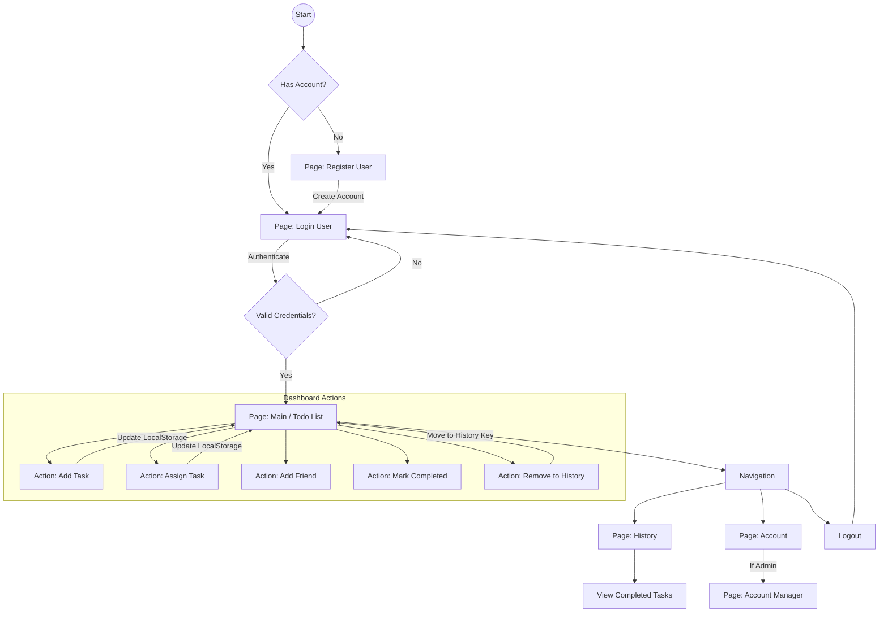

# User Flow Documentation

## Visual Flowchart

## Step-by-Step Interaction Guide

### 1. Authentication

- **Registration (`/loginPage/register`)**:
  - User enters Name, Email (Account), and Password.
  - System checks if account already exists.
  - Account is saved to `users` in LocalStorage.
  - Redirects to Login page.
- **Login (`/loginPage/login`)**:
  - User enters Email and Password.
  - System matches against `users` list.
  - On success, `user` session is stored in LocalStorage.
  - Redirects to Main Page.

### 2. Task Management (Main Page)

- **Add Todo**:
  - User fills in title and content in `AddTodo` component.
  - Clicking "Add" creates a new task object with `id`, `createUser`, and `isCompleted: false`.
  - Task is appended to the `tasks` list.
- **Assign Todo**:
  - User uses `AssignTodo` component to select a friend or user.
  - New task is created with `assignedTo` field set to the selected user's name.
- **Complete Task**:
  - User marks a task as done.
  - `isCompleted` status updates to `true`.
- **Archive/History**:
  - User clicks "Remove History" (or similar action).
  - Completed tasks belonging/assigned to the current user are moved from `tasks` to `historyTasks` in LocalStorage.
- **Delete Task**:
  - User can remove a task entirely from the list.

### 3. Friend Management

- **Add Friend**:
  - User searches for other users.
  - Adds them to their `friends` list to enable task assignment.

### 4. History Viewing

- **History Page (`/historyPage`)**:
  - Displays the list of tasks stored in `historyTasks`.
  - Read-only view of past accomplishments.

### 5. Account Management

- **Access**: Click "Account" in NavBar.
- **Admin Access**:
  - If the logged-in user has `role: 'admin'`, they can access the Manager view.
  - **Account Manager (`/accountPage/accManager`)**: View list of all registered users (ID, Name, Account).
