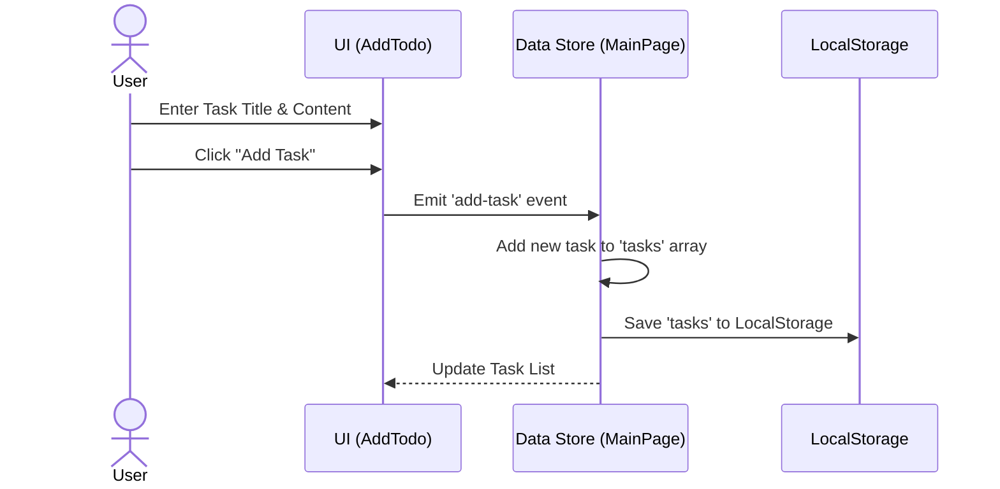
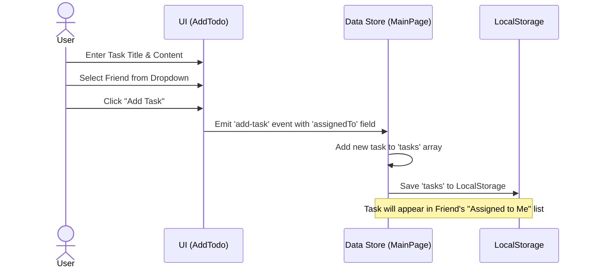
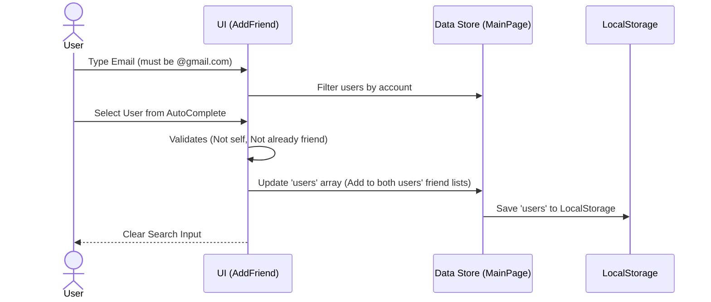
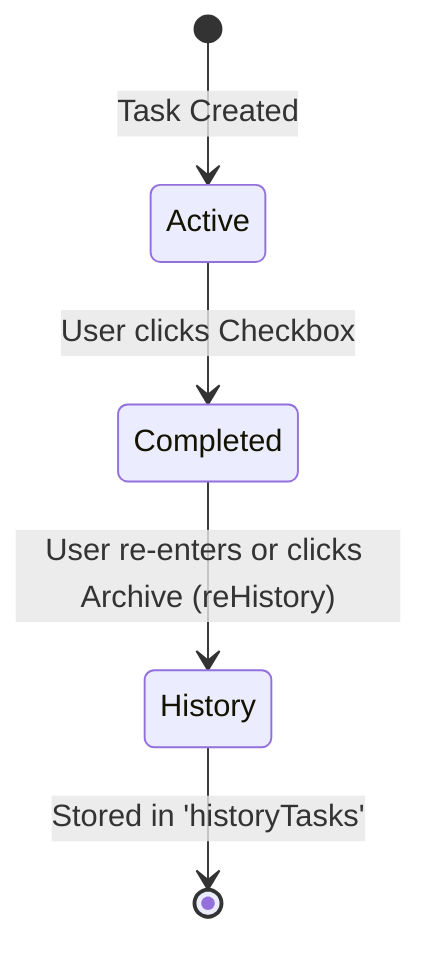

# User Flow Documentation

This document outlines the primary user journeys within the Todo List Application.

## 1. Add Personal Task

The process of a user adding a task for themselves.

## 2. Assign Task to Friend

The process of assigning a task to a friend.

## 3. Add Friend

The process of searching and adding a new friend.

## 4. Complete Task & History

How a task moves from active to history.

